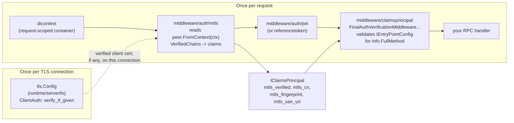
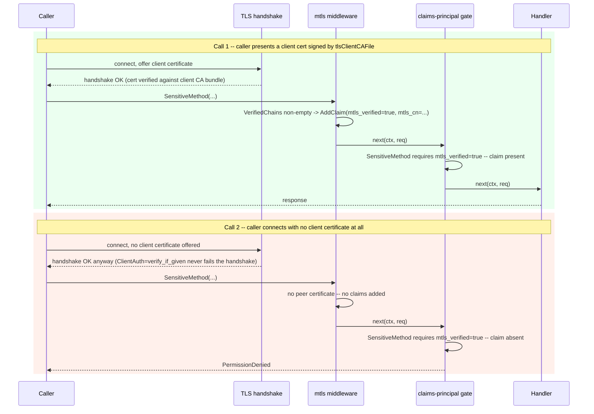

# Mutual TLS (mTLS), gated per method

Adds optional mutual TLS to the gRPC server and makes a verified client
certificate available as claims, so individual methods can require it using
the exact same per-method claims/permissions engine
(`contracts/common.IEntryPointConfig`) already used for JWT-derived
permissions.

If you don't need mTLS, none of this changes anything: `TLSEnabled` defaults
to `false`, and this middleware is a no-op when there's no TLS peer info on
the connection.

## TL;DR: clone it, run it, prove it

Nothing to configure -- this repo's example app has mTLS on by default,
against a checked-in dev certificate bundle (`example/server/certs`, see
that directory's `README.md` for what's in there and why).

**Terminal 1** -- start the server:

```sh
cd example/server
APPLICATION_ENVIRONMENT=Development go run . serve
```

**Terminal 2** (repo root) -- call `SetSecret` then `GetSecret`, presenting
the checked-in client certificate and *no bearer token at all*:

```sh
go run ./cmd/cli app_client secret set --secret-key foo --secret-value bar42
go run ./cmd/cli app_client secret get --secret-key foo
```

```text
SetSecret ok: success=true (org_id=acme key=foo)
GetSecret ok: value="bar42" (org_id=acme key=foo)
```

Both calls just succeeded on a verified client certificate alone -- no JWT,
no `Authorization` header, anywhere in this. That's `example/internal/auth`'s
entrypoint config for these two methods (`(JWT authenticated) OR
(mtls_verified)`) being satisfied by the mTLS branch. To see it actually
verifying rather than rubber-stamping, generate an unrelated certificate and
watch the same call fail at the TLS handshake, before your request's claims
are even evaluated:

```sh
go run ./cmd/cli gencert --out /tmp/other-certs --client-cn nobody
go run ./cmd/cli app_client secret get --secret-key foo \
  --cert /tmp/other-certs/client-cert.pem --cert-key /tmp/other-certs/client-key.pem
# Error: GetSecret: rpc error: code = Unavailable desc = connection error:
# desc = "error reading server preface: remote error: tls: unknown certificate authority"
```

Everything below explains how that's wired up, how to gate your own methods
the same way, and how to generate your own bundle instead of the checked-in
one.

## Why "per method" isn't a TLS setting

TLS's handshake -- and therefore whether a client certificate is requested,
and how strictly it's verified -- happens once per connection, before gRPC
even knows which method will be called; a single connection is multiplexed
across every RPC a client makes. So the TLS layer itself cannot require a cert
for method A but not method B on the same connection.

The way around that: configure TLS in *optional* mode
(`tls.VerifyClientCertIfGiven` -- request a cert, verify it if offered, never
fail the handshake outright), surface "was a verified cert presented" as a
claim, and let your existing per-method claims gate decide which methods
actually require it. TLS enforces cryptography; your claims AST enforces
policy -- same separation you already have for JWTs.

## Architecture



`middleware/auth/mtls` never fails a request by itself -- it only ever adds
claims (or adds none, if there's no verified cert) and calls through. The
claims-principal gate downstream is what actually denies a request, using the
same `IEntryPointConfig`/claims-AST mechanism as any other permission.

## Configuration (`contracts/config.CoreConfig`)

Like the rest of `CoreConfig`, these are plain camelCase fields in your
config JSON (`ConfigDefaultJSON` or an `appsettings.<env>.json` override) --
fluffycore avoids ALL_CAPS config keys where it can, these included.

| Config key | Purpose |
| --- | --- |
| `tlsCertsDir` | **The one-line way to turn this on.** Points at a directory laid out exactly the way `gencert` writes one (`server-cert.pem`, `server-key.pem`, `ca.pem`); setting it alone implies `tlsEnabled` and fills in whichever of the three paths below you didn't set explicitly. This repo's own example app defaults it to `./certs`, resolved relative to wherever `example/server` runs from -- i.e. `example/server/certs`, the checked-in dev bundle (see that directory's `README.md`) -- so mTLS is on out of the box. |
| `tlsEnabled` | `true` turns on TLS for the gRPC server. Default `false` (plaintext) unless `tlsCertsDir` is set. |
| `tlsCertFile` / `tlsKeyFile` | PEM paths for the server's own certificate/key. Required (directly or via `tlsCertsDir`) when TLS is enabled. Explicit values here always win over what `tlsCertsDir` would derive. |
| `tlsClientCAFile` | PEM path of CA(s) the server trusts to have issued a client cert. **Setting this (directly or via `tlsCertsDir`) is what turns on mutual TLS.** Leave empty (and don't set `tlsCertsDir`) for plain server-only TLS. |
| `tlsClientAuth` | `none` \| `request` \| `verify_if_given` \| `require`. Defaults to `verify_if_given` when a client CA bundle is resolved, `none` otherwise. Use `require` only if you want mTLS mandatory for *every* method on the server -- the simpler, connection-wide alternative to the per-method approach this README is about. |

Use `tlsCertsDir` for the common case (one directory, `gencert`'s layout);
reach for the three explicit paths when a real issuer hands you files under
different names or in different places (e.g. Vault Agent template output) --
they compose, so you can set `tlsCertsDir` as a fallback default and
override just the one path that differs.

All resolved file paths are re-read from disk whenever their contents change
(checked every few seconds, on the handshake hot path) -- see
[Production: cert rotation via Vault](#production-cert-rotation-via-vault).

## Claims added (`wellknown/claim-types.go`)

Added only when the TLS stack itself cryptographically verified the
presented certificate against `tlsClientCAFile` (`VerifiedChains` non-empty)
-- never merely because a certificate was present. Under `tlsClientAuth: request`,
Go doesn't verify at all, so no claims are added there either; use
`verify_if_given` or `require`.

| Claim type | Value |
| --- | --- |
| `mtls_verified` | `"true"` |
| `mtls_cn` | the verified client certificate's Subject CommonName |
| `mtls_fingerprint` | SHA-256 (hex) of the certificate's raw DER bytes -- pin to one specific cert instead of trusting CN |
| `mtls_san_uri` | each URI SAN on the certificate (e.g. a SPIFFE ID like `spiffe://cluster.local/ns/foo/sa/bar`, as HashiCorp Vault's PKI secrets engine commonly issues) -- one claim per URI |

## Gate a method on mTLS

Exactly like gating on any other permission -- add a claim requirement to that
method's `IEntryPointConfig`:

```go
grpcEntrypointClaimsMap := map[string]contracts_common.IEntryPointConfig{
    "/my.package.MyService/SensitiveMethod": entryPointConfigRequiring(
        claimsprincipalContracts.Claim{Type: fluffycore_wellknown.ClaimTypeMTLSVerified, Value: "true"},
    ),
    // pin to one specific client instead of "any verified cert":
    "/my.package.MyService/EvenMoreSensitiveMethod": entryPointConfigRequiring(
        claimsprincipalContracts.Claim{Type: fluffycore_wellknown.ClaimTypeMTLSCommonName, Value: "billing-service"},
    ),
}
```

(`entryPointConfigRequiring` is however you already build an `IEntryPointConfig`
from an AND-list of claims in your app -- see `services/common/claimsprincipal`'s
claims AST and your existing `FuncAuthGetEntryPointConfigs`.)

## Two calls, same method requiring mTLS: allowed vs. denied



The TLS handshake succeeds in *both* calls -- that's the point of
`verify_if_given`. Whether the request actually proceeds is decided entirely
by the claims gate, per method, same as it always was.

## Testing locally: a real client-to-server mTLS handshake

There's nothing to generate to try this out: this repo checks in a dev
CA/server/client certificate set at `example/server/certs` (see that
directory's `README.md` for what's in there and why committing the private
keys is fine for this specific, throwaway bundle), and
`example/internal/contracts/config`'s default config points `tlsCertsDir`
at it (`./certs`, resolved relative to `example/server`) -- so mTLS is
already on. `example/server` reads a config file (`config/clients.json`)
relative to its own directory, so `cd` into it first rather than `go run
./example/server ...` from elsewhere:

```sh
cd example/server
APPLICATION_ENVIRONMENT=Development go run . serve
```

look for `"message":"enabling gRPC server TLS","mutualTLS":true` in its
startup log. See the [TL;DR](#tldr-clone-it-run-it-prove-it) above for the
two-command proof against `SetSecret`/`GetSecret`.

To generate your own bundle instead (a different host/SAN, a different
client identity, or just not reusing the shared repo one), use this repo's
`cmd/cli gencert` (run from the repo root; it shares its generator,
`utils/certgen`, with the `certs/README.md`-documented checked-in bundle, so
there's only one implementation to keep in sync):

```sh
go run ./cmd/cli gencert --out ./example/server/my-certs --host localhost --host 127.0.0.1 --client-cn my-test-client
```

This writes `ca.pem`, `ca-key.pem`, `server-cert.pem`, `server-key.pem`,
`client-cert.pem`, `client-key.pem` into `example/server/my-certs`. Add
`--forever` for a set that (like the checked-in one) is valid ~100 years
instead of the default 365 days -- appropriate for something checked in or
otherwise not meant to need periodic regeneration; never for anything
production-facing. Then point at it (again from `example/server`, so the
relative path matches where you generated it):

```sh
cd example/server
EXAMPLE_TLSCERTSDIR=./my-certs APPLICATION_ENVIRONMENT=Development go run . serve
```

(`EXAMPLE_` is this app's `EnvPrefix`; viper's automatic env-var matching
uppercases the config key as a single word, no inserted underscore -- so a
camelCase key like `tlsCertsDir` becomes `EXAMPLE_TLSCERTSDIR`, not
`EXAMPLE_TLS_CERTS_DIR`. Editing `ConfigDefaultJSON`/an `appsettings.*.json`
file directly reads more naturally if you're setting this permanently rather
than for one run.)

(Any other `cobracore`-based app -- one you write, not this repo's example
-- gets `gencert` on its own binary the same way, alongside `serve`, since it
inherits every command `cobracore/cmd` registers.)

Then dial it from a Go client presenting the client certificate (substitute
`example/server/my-certs` for `example/server/certs` if you generated your
own bundle above):

```go
clientCert, err := tls.LoadX509KeyPair("example/server/certs/client-cert.pem", "example/server/certs/client-key.pem")
caPEM, err := os.ReadFile("example/server/certs/ca.pem")
rootCAs := x509.NewCertPool()
rootCAs.AppendCertsFromPEM(caPEM)

creds := credentials.NewTLS(&tls.Config{
    Certificates: []tls.Certificate{clientCert},
    RootCAs:      rootCAs,
    ServerName:   "localhost",
})
conn, err := grpc.NewClient("localhost:50051", grpc.WithTransportCredentials(creds))
```

(`cmd/cli app_client secret set|get`, used in the TL;DR above, does exactly
this -- see `cmd/cli/root/app_client/secret/secret.go` for the full,
runnable version instead of the excerpt above.)

A call through `conn` to a method gated on `mtls_verified` should now succeed;
dialing without `Certificates` set (or presenting one `tlsClientCAFile`
doesn't trust) demonstrates the denied path.

`gencert --force` regenerates a set in place; see `gencert --help` for
`--server-cn`, `--client-uri` (for a SPIFFE-style client identity), `--days`,
and `--org`. It's a development/testing tool -- see the next section for
production.

## Production: cert rotation via Vault

`tlsCertFile`/`tlsKeyFile`/`tlsClientCAFile` are plain file paths
precisely so a secret-injection agent can own them: point them at whatever
HashiCorp Vault Agent (via `template` blocks), the Vault Secrets
Operator/CSI provider, or cert-manager writes to disk -- typically a
short-lived certificate from Vault's PKI secrets engine, renewed well before
expiry.

`runtime/servertls` re-checks each file's mtime on the TLS handshake hot path
(throttled to once every few seconds) and reloads whichever changed, so a
Vault-rotated cert takes effect **without restarting the process**. If a
reload attempt fails (e.g. the agent is mid-write), the server keeps serving
the last-known-good certificate rather than failing handshakes.

## Caveats

- **Enforcement is per method, but the certificate is presented per
  connection.** A client that wants to call an mTLS-gated method must offer
  its certificate when it opens that connection -- it can't omit the cert "for
  the methods that don't need it" and still call a gated one over the same
  connection. In practice this just means: clients calling gated methods dial
  with a client certificate configured; everyone else doesn't need one.
- **`mtls_cn`/pinning claims trust whatever the CA issued.** If you gate on a
  specific `mtls_cn`, that's only as strong as your CA's issuance controls --
  anyone who can get your CA to sign a cert with that CN gets the claim.
  Prefer `mtls_fingerprint` (or a SPIFFE-style `mtls_san_uri`) when you need to
  pin to one specific, non-reissuable identity.
