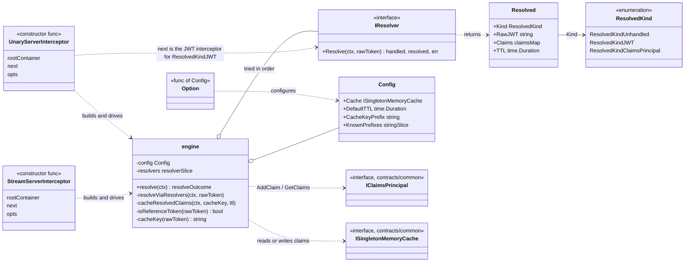
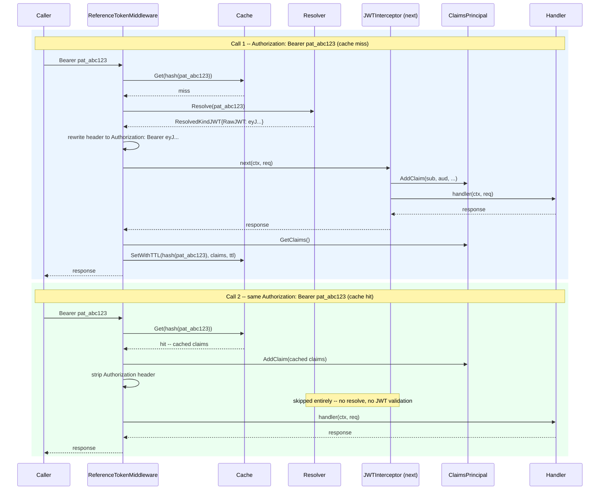

# Reference Token Middleware

Opt-in gRPC middleware for services that accept an opaque external token (most
commonly a Personal Access Token, PAT) in the normal `Authorization: Bearer <token>`
header, alongside your regular JWTs. It resolves the opaque token, caches the
result for a TTL, and makes sure nothing downstream of it ever sees the raw
token.

If your service only ever sees real JWTs, you don't need this package at all --
skip it and keep using `middleware/auth/jwt` on its own.

## What you get for free

- Ordinary JWTs and requests with no `Authorization` header pass straight
  through untouched -- resolvers are never consulted for them.
- Opaque tokens are resolved once and the result is cached; every request within
  the TTL skips resolution (and, for JWT-shaped results, skips JWT signature
  validation too).
- The opaque token is stripped from (or replaced in) request metadata before the
  request proceeds, so no other middleware or handler ever observes it.

## Types at a glance



`engine` is the transport-agnostic core (unexported) -- it decides pass-through
vs. delegate-to-JWT vs. direct-from-cache/claims and does the actual cache
reads/writes. `UnaryServerInterceptor`/`StreamServerInterceptor` are the thin,
transport-specific wrappers that build one `engine` per call and translate its
decision into gRPC's `handler`/`next` calling convention (see the sequence
diagram below for that decision in motion).

## Two calls, same PAT: the cache in action

Call 1 resolves the PAT, lets the JWT pipeline populate the claims principal,
and snapshots the result into the cache. Call 2, moments later, presents the
same PAT and is recognized from the cache -- the resolver and the JWT
interceptor are both skipped entirely.



What changes between the two calls:

| Step | Call 1 (miss) | Call 2 (hit) |
| --- | --- | --- |
| Cache lookup | miss | hit |
| Resolver invoked? | yes | **no** |
| JWT interceptor (`next`) invoked? | yes -- validates the resolved JWT | **no** |
| Claims principal populated from | `next`'s claims, snapshotted after | the cached snapshot directly |
| Authorization header seen downstream | the resolved JWT (never the raw PAT) | none -- stripped entirely |

Everything after `RefTokenMW` in the pipeline (the claims-principal
authorization gate, your handler) behaves identically either way -- it only
ever sees a populated `IClaimsPrincipal`, never the raw PAT and never a
resolve-vs-cache distinction to worry about.

## Steps to opt in

### 1. Implement an `IResolver`

```go
import (
    "context"

    referencetoken "github.com/fluffy-bunny/fluffycore/contracts/middleware/auth/referencetoken"
)

type patResolver struct {
    store PATStore // whatever looks up your PATs -- DB, cache, etc.
}

func (r *patResolver) Resolve(ctx context.Context, rawToken string) (bool, *referencetoken.Resolved, error) {
    // Return handled=false, nil, nil for tokens this resolver doesn't recognize
    // (wrong prefix/shape) so other resolvers -- or the "unrecognized token"
    // failure -- get a chance.
    if !strings.HasPrefix(rawToken, "pat_") {
        return false, nil, nil
    }

    record, err := r.store.Lookup(ctx, rawToken)
    if err != nil {
        // Recognized but invalid (revoked/expired/store down): a hard auth
        // failure, NOT a fall-through to other resolvers.
        return true, nil, err
    }

    // Case A: the PAT is backed by a JWT your existing JWT validators already
    // know how to check. Let them do it.
    return true, &referencetoken.Resolved{
        Kind:   referencetoken.ResolvedKindJWT,
        RawJWT: record.JWT,
        TTL:    5 * time.Minute, // optional; falls back to the middleware default
    }, nil

    // -- OR --

    // Case B: resolution already IS the final identity (e.g. an introspection
    // call). No JWT to hand off.
    // return true, &referencetoken.Resolved{
    //     Kind: referencetoken.ResolvedKindClaimsPrincipal,
    //     Claims: map[string]interface{}{
    //         "sub":  record.Subject,
    //         "aud":  record.Audience,
    //         "scope": []string{"read", "write"},
    //     },
    // }, nil
}
```

Pick **Case A** if the PAT ultimately maps to a JWT you already trust and
validate. Pick **Case B** if resolution itself establishes identity and there's
no JWT involved. A single resolver can return either kind per-token if you
support more than one PAT format.

### 2. Register the resolver and a cache in your DI builder

```go
import (
    referencetoken_mw "github.com/fluffy-bunny/fluffycore/middleware/auth/referencetoken"
    servicescache "github.com/fluffy-bunny/fluffycore/services/common/cache"
)

func Configure(builder di.ContainerBuilder) {
    // ... your other registrations ...

    referencetoken_mw.AddResolver(builder, func() referencetoken.IResolver {
        return &patResolver{store: myPATStore}
    })

    // Reuse an existing ISingletonMemoryCache registration, or add one:
    servicescache.AddMemoryCache(builder)
}
```

`AddResolver`'s `ctor` can take any parameters resolvable from the container
(plain DI constructor injection) -- register as many resolvers as you need, one
per PAT format/issuer; they run in registration order until one returns
`handled=true`.

### 3. Wrap the JWT interceptor instead of registering it standalone

Wherever you currently do this (typically your app's `startup.Configure`, or
`runtime/otel`'s `ConfigureServerOpts` if you've forked it):

```go
jwtInterceptor := jwt.UnaryServerInterceptor(rootContainer)

serverOpts = append(serverOpts, grpc.ChainUnaryInterceptor(
    referencetoken_mw.UnaryServerInterceptor(rootContainer, jwtInterceptor,
        referencetoken_mw.WithCache(di.Get[fluffycore_contracts_common.ISingletonMemoryCache](rootContainer)),
        referencetoken_mw.WithDefaultTTL(fluffycore_contracts_common.FiveMinutes),
    ),
))
```

Do the same for streams with `jwt.StreamServerInterceptor` /
`referencetoken_mw.StreamServerInterceptor`.

**Ordering matters**: this must sit exactly where the JWT interceptor used to
sit -- after `dicontext.ScopedContextUnaryServerInterceptor` (needs the
request-scoped container) and before the claims-principal authorization gate. It
assumes the scoped `IClaimsPrincipal` is empty when it runs.

### 4. Tag your PATs with a static prefix, and configure it

Callers need to be able to use a JWT or a PAT interchangeably in the same
`Authorization: Bearer <token>` header, so this middleware has to tell them
apart on every request. The standard, unambiguous way to do that -- the same
convention GitHub (`ghp_`), GitLab (`glpat-`), Stripe (`sk_live_`), Slack
(`xoxb-`), and npm (`npm_`) all use for their own PATs/API keys -- is a short,
fixed, static prefix baked into the token itself:

```go
const patPrefix = "pat_" // pick your own; make it yours, e.g. "mysvc_pat_"
```

Issue every PAT with that prefix, and tell the middleware about it:

```go
referencetoken_mw.WithKnownPrefixes(patPrefix),
```

With this set, detection is exact: anything starting with `patPrefix` goes to
your resolvers, everything else (including a plain JWT, or garbage) passes
straight through to the JWT pipeline untouched. **This is the recommended
setup -- prefer it over the fallback described below.**

If you don't configure `WithKnownPrefixes`, the middleware falls back to a
structural guess: a JWT always has exactly two dots
(`header.payload.signature`); anything else is treated as an opaque reference
token. This works fine for typical opaque PATs (e.g. plain UUIDs, which have no
dots at all), but it's still a guess -- if your PAT format could ever contain
exactly two dots, it would be misrouted as "ordinary JWT" and never reach your
resolver. Configuring a prefix removes that ambiguity entirely, and is also
what makes leaked PATs detectable by secret-scanning tools (GitHub push
protection, GitGuardian, etc.), which key off exactly this kind of prefix.

### 5. (Optional) tune the remaining options

| Option | Default | Purpose |
| --- | --- | --- |
| `WithCache(cache)` | none (caching disabled) | TTL cache for resolved claims. Without it, every request re-resolves. |
| `WithDefaultTTL(d)` | 5 minutes | Fallback TTL when a resolver's `Resolved.TTL` is `<= 0`. |
| `WithCacheKeyPrefix(s)` | `"reftok:"` | Namespaces cache keys if the cache is shared with other middleware. |
| `WithKnownPrefixes(s...)` | none (falls back to shape-guessing) | The static prefix(es) your PATs are tagged with. See step 4 -- recommended. |

That's it -- nothing else in the pipeline needs to change. Existing JWT-only
traffic is unaffected.
